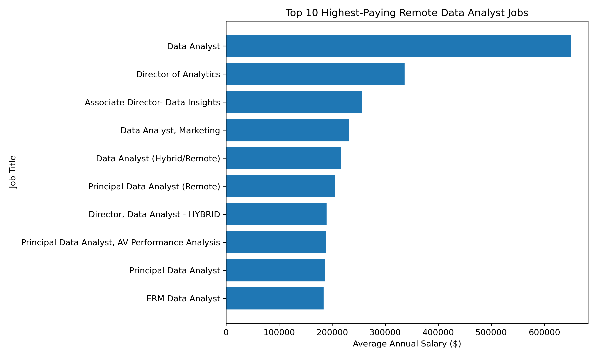
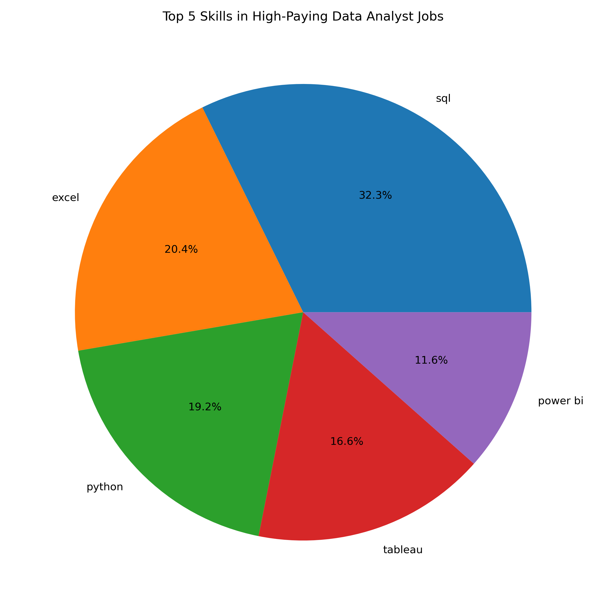
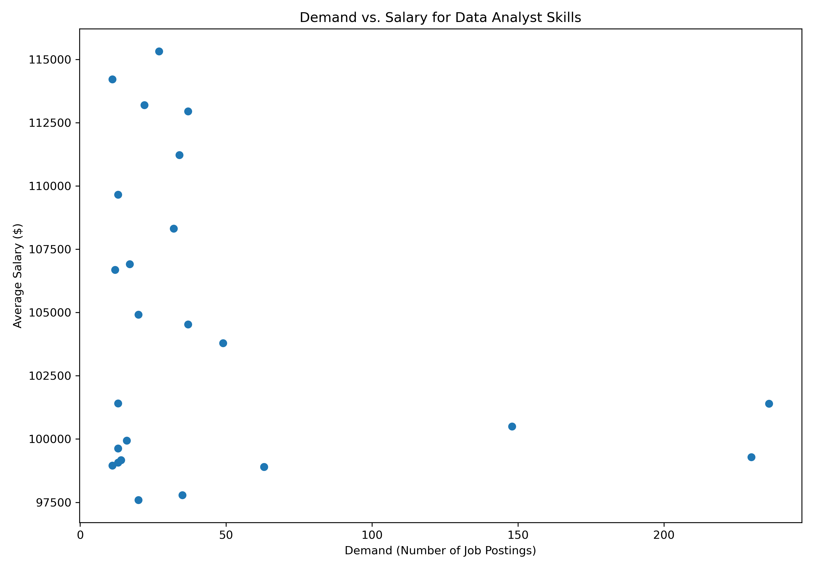

# Data Analyst Job Market Analysis

## Introduction

This project analyzes the data analyst job market to explore top-paying positions, in-demand skills, and the relationship between skills and salary.

The goal of this project was to use SQL to answer practical questions about the data analyst job market and identify skills that may be valuable for aspiring data analysts to develop.

The project was completed as a hands-on SQL learning project based on the **SQL course by Luke Barousse**, with the analysis and SQL queries developed as part of my own practice.

**SQL queries:** [`project_sql/`](./project_sql/)

---

## Background

As I explored the data analyst job market, I wanted to better understand:

* Which data analyst jobs offer the highest salaries?
* What skills are commonly required for high-paying positions?
* Which skills are most frequently requested by employers?
* Which skills are associated with higher salaries?
* What skills could provide a strong combination of demand and earning potential?

This project uses job posting data to investigate these questions through SQL and PostgreSQL.

The dataset and course materials were provided through **Luke Barousse's SQL course**.

---

## Questions I Wanted to Answer

The SQL analysis focuses on five main questions:

1. What are the top-paying data analyst jobs?
2. What skills are required for these top-paying jobs?
3. What skills are most in demand for data analysts?
4. Which skills are associated with higher salaries?
5. What are the most optimal skills to learn based on demand and salary?

---

## Tools I Used

* **SQL** – Used to query, filter, join, aggregate, and analyze the job posting data.
* **PostgreSQL** – Used as the database management system for the project.
* **Python** – Used with Pandas and Matplotlib to create data visualizations.
* **Visual Studio Code** – Used to write and execute SQL queries.
* **Git & GitHub** – Used for version control and to document and share the project.

---

## The Analysis

### 1. Top-Paying Data Analyst Jobs

I identified the 10 highest-paying remote Data Analyst positions with reported annual salaries.




### 2. Top Paying Data Analyst Job Skills

Identified the skills associated with the 10 highest-paying remote Data Analyst jobs. 

```sql
WITH top_paying_jobs AS(
    SELECT 
        job_id,
        job_title,
        salary_year_avg,
        name AS company_name
    FROM 
        job_postings_fact
    LEFT JOIN company_dim 
        ON job_postings_fact.company_id=company_dim.company_id
    WHERE
        job_title_short = 'Data Analyst' AND
        job_location = 'Anywhere' AND
        salary_year_avg IS NOT NULL
    ORDER BY
        salary_year_avg DESC
    LIMIT 10
)

SELECT 
    top_paying_jobs.*,
    skills
FROM top_paying_jobs
INNER JOIN skills_job_dim ON top_paying_jobs.job_id = skills_job_dim.job_id
INNER JOIN skills_dim ON skills_job_dim.skill_id = skills_dim.skill_id
ORDER BY
    salary_year_avg DESC
```

### 3. Most In-Demand Skills

I examined the frequency of skills appearing across data analyst job postings to identify which skills employers request most often.



### 4. Top Paying Skills

The results show that SQL, Excel, Python, Tableau, and Power BI are among the skills associated with higher average salaries for remote Data Analyst positions.

### 5. Optimal Skills to Learn

Identified skills that appear in more than 10 remote Data Analyst job postings and compared their demand with average salary. The results highlight skills that combine relatively high job demand with strong salary levels, providing a useful perspective on which skills may be valuable to develop.



---

## Data Source

The dataset used in this project comes from **Luke Barousse's SQL course**.

Course: [Luke Barousse – SQL Course](https://lukebarousse.com/sql)

The project uses the course dataset as a learning resource for practicing SQL and exploring the data analyst job market.

---

## Conclusion

This project allowed me to apply SQL to a realistic job-market dataset and investigate questions that are relevant to aspiring data analysts.

By analyzing job postings, salaries, and skill requirements, I gained practical experience using PostgreSQL to transform raw job-posting data into meaningful insights.

This project was also an opportunity to strengthen my SQL fundamentals through a structured course while applying the concepts to a complete end-to-end analysis.
